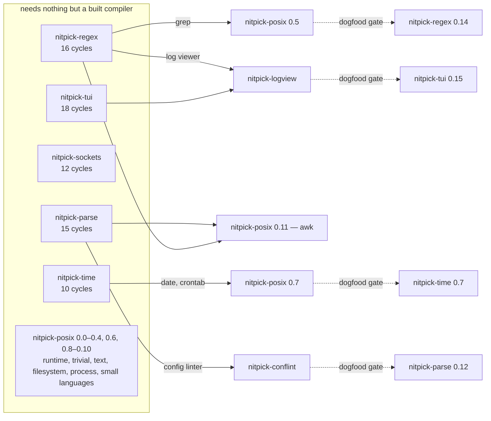

# Work streams — the dependency graph, and how to run three agents on it

The plan for **parallel implementation**, built before it is needed. It answers
three questions: what depends on what, which work can proceed at the same time
without collision, and how a stream claims work so two agents never touch one
repository.

The live state is [`BOARD.md`](BOARD.md). This file is the durable part.

---

## 1. The headline, measured rather than assumed

**The compiler gates almost none of this.** Everything each repository's plan
calls cycles 0.0 through roughly 0.15 — the probes, the harness, the storage
primitives, the device layers, the engines, the widgets, the utilities — needs
only a **built compiler**, which exists. Nothing waits on cycle 1.5 or 1.6.

What the compiler *does* gate, exhaustively:

| Compiler capability | What it unblocks | Where it bites |
|---|---|---|
| **1.5.1 – 1.5.4** — the verification surface typed, `limit<Rules>`, contracts, `prove` | turning each repository's `VERIFICATION.md` obligations from comments with property tests into real clauses | each library's **hardening** cycle, near its 1.0. Nothing earlier |
| **O-N2** — `npkg` builds a library, `[dependencies]` resolves | retiring each Python harness; making cross-repo imports non-relative | **nothing**. Both are worked around by design, and the workaround is the plan |
| **O-N1** — `clone_exec` takes a signal mask | removing `ntui`'s unblock-around-spawn window | `ntui` 0.1.6 only, and it has a working answer already |
| **O-N5** — `npkg` builds many artifacts | `nitpick-posix`'s build | nothing; the harness does it |
| ~~**O-N6**~~ — a macro can splice a `pick` into a function body | **`nitpick-posix`'s entire shape** (PX-010) | **CLOSED 2026-09-03, negative.** It cannot, and a macro cannot be shared between modules at all. `failsafe` is generated (PX-100). The one real unknown is now a known |

**Rule W-1 — DISCHARGED 2026-09-03.** *O-N6 was answered before `nitpick-posix` was scheduled into a stream, which is what the rule asked for; the answer was negative and cost part of one day at cycle 0.0. Kept below as written, because the next repository with a load-bearing unknown gets the same treatment.* — O-N6 is answered before `nitpick-posix` is scheduled into a
stream.** It is one probe, it takes an afternoon, and a negative answer
replans a fourteen-cycle repository. Run it early and out of band.

---

## 2. The graph

**Rule W-2 — the libraries do not depend on each other.** `[dependencies]` is
empty everywhere by decision, and the only recorded overlaps (Unicode tables
between `ntui` and `nregex`; datetime scanning between `nparse` and `ntime`)
are *open questions*, not edges. Five of the six repositories can be worked in
any order, simultaneously.

**Rule W-3 — every cross-repository edge is a dogfood consumer, and every one
of them is mutual.** `nitpick-posix` 0.5 needs `nregex` finished; `nregex` 0.14
needs `grep` written and *used*. Neither closes alone. The dotted edges above
are that second half, and they are why a stream cannot simply run to the end of
its list.

---

## 3. The three streams

Chosen so that each owns whole repositories, no two share one, and the
cross-stream edges land where the streams naturally arrive at them.

| Stream | Repositories, in order | Size |
|---|---|---|
| **1 — text** | `nitpick-regex` → `nitpick-tui` → `nitpick-logview` | 34 cycles + an app |
| **2 — data** | `nitpick-time` → `nitpick-parse` → `nitpick-conflint` | 25 cycles + an app |
| **3 — system** | `nitpick-sockets` → `nitpick-posix` | 26 cycles |

**Why this partition and not another.** Three properties, in order of weight:

1. **`nitpick-posix` is the convergence point** — it consumes `nregex`,
   `ntime` and `nparse` — so it goes last in its stream, and the stream it is
   in should be the one whose *own* first item is smallest. `sockets` (12) is
   that item.
2. **The gated cycles arrive when their dependency is ready.** Stream 3 reaches
   `nitpick-posix` 0.5 (`grep`) at about unit 17, and stream 1 finishes
   `nregex` at unit 16. `nitpick-posix` 0.7 (`date`) lands at about unit 19,
   and stream 2 finishes `ntime` at unit 10 — comfortably early. `awk` at
   about unit 23 wants `nparse`, which stream 2 finishes at 25. That last one
   is tight and §5 says what to do about it.
3. **The recorded overlaps stay inside a stream where possible.** `nregex` and
   `ntui` both want Unicode tables and are both stream 1, so the second one
   inherits the first one's approach instead of inventing a second.

**Rule W-4 — sizes are estimates and the first completed cycle recalibrates
them.** Cycle counts are a poor proxy: `ntui` 0.11 (core widgets) is worth
several of `ntime` 0.2. After each stream closes its first cycle, the
orchestrator re-reads the partition against measured wall-clock and rebalances
`BOARD.md`. Pretending the initial split is right is how a stream ends up idle
for a week.

---

## 4. Running fewer than three

**Rule W-5 — the streams are ordered so that running only stream 1 is a
coherent plan.** This is deliberate: the number of concurrent agents is a dial,
not a constant, and the plan must degrade rather than require its full width.

| Width | What to run | What you get |
|---|---|---|
| **1** | stream 1, then 2, then 3 | the whole ecosystem, serially, in dependency order. Longest, simplest, and the right choice when attention is the scarce resource |
| **2** | streams 1 and 2 | the five libraries, with `nitpick-posix` and the apps after. No cross-stream waiting at all until the dogfood cycles |
| **3** | all three | fastest, and the only width where §3's timing analysis matters |

**Rule W-6 — a stream is never split across agents.** One agent owns a stream
for the duration of a session. Two agents in one repository is the failure the
compiler's own R2 forbids permanently, and a stream is the unit that makes that
enforceable.

---

## 5. The rules

**Rule W-7 — one writer per repository, always.** A stream claims a repository
in `BOARD.md` before touching it and releases it when the cycle closes. A
repository with no claim is nobody's.

**Rule W-8 — the orchestrator owns `BOARD.md`.** Agents do not edit it. That
removes every merge conflict by construction and matches the compiler's
`ORCHESTRATION.md` R8, which gives the orchestrator assignment, integration,
record-keeping and escalation routing — and no code.

**Rule W-9 — a cross-stream gate is a hand-off, and it is scheduled.** When
stream 3 reaches `nitpick-posix` 0.5, it needs `nregex` *finished*, not
*in progress*. The orchestrator checks the board before releasing the claim. If
the dependency is not ready, the stream takes the next unblocked cycle in the
same repository rather than idling — `nitpick-posix` has nine ungated cycles
and they exist precisely for this.

**Rule W-10 — a mutual dogfood gate closes in one direction first.** Write the
consumer, use it, record the findings, *then* close the library's cycle with
those findings triaged. The library's cycle is gated on the program being
**used**, not on it compiling, so the order is forced and the board records
both halves separately.

**Rule W-11 — a compiler defect found in any stream stops that stream and is
escalated, never worked around.** The compiler's R6, and the reason applies
with more force here: a workaround buried in library code outlives the bug and
is indefensible at verification time.

**Rule W-12 — a red under parallel load is a stop sign, never a retry.** R5.
Every timing-shaped defect this ecosystem has found looked like flakiness
first.

**Rule W-13 — independently green is not green.** R3. Where two streams have
touched anything shared — the playbook, a registry, a workbench document — the
orchestrator merges and re-checks rather than collecting green branches.

---

## 6. What could start today

Six things need nothing that does not already exist, and each is roughly a day:

| Work | Why now |
|---|---|
| **`nitpick-posix` 0.0.0 probe 02** | W-1. It gates a fourteen-cycle repository's shape and nothing else can be scheduled around it until it is answered |
| each library's **cycle 0.0 probes** | every one of them exists to find out whether the design is spellable, and a negative answer changes a specification. Five repositories, five afternoons, and they are independent |
| **`nitpick-libs` O-N2 request** | raised with the compiler side. It blocks nothing but it has a long lead time |

**Rule W-14 — the probes are the cheapest possible risk reduction and they are
already written.** Every repository's `0.0.0.md` is execution-grade. Running
them before the compiler frees up converts six unknowns into six facts, and any
one of them coming back negative is worth knowing before a stream is committed
to a plan built on it.
