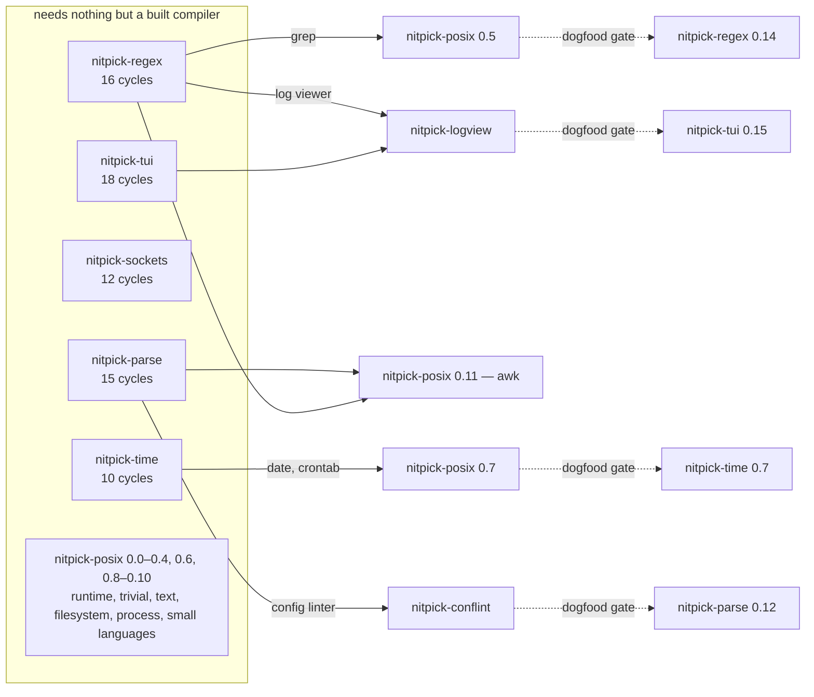

# Work streams — the dependency graph, and how to run three agents on it

The plan for **parallel implementation**, built before it is needed. It answers
three questions: what depends on what, which work can proceed at the same time
without collision, and how a stream claims work so two agents never touch one
repository.

The live state is [`BOARD.md`](BOARD.md). This file is the durable part.

---

## 1. The headline, measured rather than assumed

**The compiler gates almost none of this.** Everything each repository's plan
calls cycles 0.0 through roughly 0.15 — the probes, the harness, the storage
primitives, the device layers, the engines, the widgets, the utilities — needs
only a **built compiler**, which exists. Nothing waits on cycle 1.5 or 1.6.

What the compiler *does* gate, exhaustively:

| Compiler capability | What it unblocks | Where it bites |
|---|---|---|
| **1.5.1 – 1.5.4** — the verification surface typed, `limit<Rules>`, contracts, `prove` | turning each repository's `VERIFICATION.md` obligations from comments with property tests into real clauses | each library's **hardening** cycle, near its 1.0. Nothing earlier |
| **O-N2** — `npkg` builds a library, `[dependencies]` resolves | retiring each Python harness; making cross-repo imports non-relative | **nothing**. Both are worked around by design, and the workaround is the plan |
| **O-N1** — `clone_exec` takes a signal mask | removing `ntui`'s unblock-around-spawn window | `ntui` 0.1.6 only, and it has a working answer already |
| **O-N5** — `npkg` builds many artifacts | `nitpick-posix`'s build | nothing; the harness does it |
| ~~**O-N6**~~ — a macro can splice a `pick` into a function body | **`nitpick-posix`'s entire shape** (PX-010) | **CLOSED 2026-09-03, negative.** It cannot, and a macro cannot be shared between modules at all. `failsafe` is generated (PX-100). The one real unknown is now a known |

The `O-N` ids above are the workbench registry's —
[`meta/OPEN_QUESTIONS.md`](meta/OPEN_QUESTIONS.md) §"For the compiler" —
because each repository numbers its own requests and the numbers collide.

**Rule W-1 — DISCHARGED 2026-09-03.** *O-N6 was answered before `nitpick-posix` was scheduled into a stream, which is what the rule asked for; the answer was negative and cost part of one day at cycle 0.0. Kept below as written, because the next repository with a load-bearing unknown gets the same treatment.* — O-N6 is answered before `nitpick-posix` is scheduled into a
stream.** It is one probe, it takes an afternoon, and a negative answer
replans a fourteen-cycle repository. Run it early and out of band.

---

## 2. The graph

**Rule W-2 — the libraries do not depend on each other.** `[dependencies]` is
empty everywhere by decision, and the only recorded overlaps (Unicode tables
between `ntui` and `nregex`; datetime scanning between `nparse` and `ntime`)
are *open questions*, not edges. Five of the six repositories can be worked in
any order, simultaneously.

**Rule W-3 — every cross-repository edge is a dogfood consumer, and every one
of them is mutual.** `nitpick-posix` 0.5 needs `nregex` finished; `nregex` 0.14
needs `grep` written and *used*. Neither closes alone. The dotted edges above
are that second half, and they are why a stream cannot simply run to the end of
its list.

---

## 3. The three streams

Chosen so that each owns whole repositories, no two share one, and the
cross-stream edges land where the streams naturally arrive at them.

| Stream | Repositories, in order | Size |
|---|---|---|
| **1 — text** | `nitpick-regex` → `nitpick-tui` → `nitpick-logview` | 34 cycles + an app |
| **2 — data** | `nitpick-time` → `nitpick-parse` → `nitpick-conflint` | 25 cycles + an app |
| **3 — system** | `nitpick-sockets` → `nitpick-posix` | 26 cycles |

**Why this partition and not another.** Three properties, in order of weight:

1. **`nitpick-posix` is the convergence point** — it consumes `nregex`,
   `ntime` and `nparse` — so it goes last in its stream, and the stream it is
   in should be the one whose *own* first item is smallest. `sockets` (12) is
   that item.
2. **The gated cycles arrive when their dependency is ready.** Stream 3 reaches
   `nitpick-posix` 0.5 (`grep`) at about unit 17, and stream 1 finishes
   `nregex` at unit 16. `nitpick-posix` 0.7 (`date`) lands at about unit 19,
   and stream 2 finishes `ntime` at unit 10 — comfortably early. `awk` at
   about unit 23 wants `nparse`, which stream 2 finishes at 25. That last one
   is tight and §5 says what to do about it.
3. **The recorded overlaps stay inside a stream where possible.** `nregex` and
   `ntui` both want Unicode tables and are both stream 1, so the second one
   inherits the first one's approach instead of inventing a second.

**Rule W-4 — sizes are estimates and the first completed cycle recalibrates
them.** Cycle counts are a poor proxy: `ntui` 0.11 (core widgets) is worth
several of `ntime` 0.2. After each stream closes its first cycle, the
orchestrator re-reads the partition against measured wall-clock and rebalances
`BOARD.md`. Pretending the initial split is right is how a stream ends up idle
for a week.

---

## 4. Running fewer than three

**Rule W-5 — the streams are ordered so that running only stream 1 is a
coherent plan.** This is deliberate: the number of concurrent agents is a dial,
not a constant, and the plan must degrade rather than require its full width.

| Width | What to run | What you get |
|---|---|---|
| **1** | stream 1, then 2, then 3 | the whole ecosystem, serially, in dependency order. Longest, simplest, and the right choice when attention is the scarce resource |
| **2** | streams 1 and 2 | the five libraries, with `nitpick-posix` and the apps after. No cross-stream waiting at all until the dogfood cycles |
| **3** | all three | fastest, and the only width where §3's timing analysis matters |

**Rule W-6 — a stream is never split across agents.** One agent owns a stream
for the duration of a session. Two agents in one repository is the failure the
compiler's own R2 forbids permanently, and a stream is the unit that makes that
enforceable.

---

## 5. The rules

**Rule W-7 — one writer per repository, always.** A stream claims a repository
in `BOARD.md` before touching it and releases it when the cycle closes. A
repository with no claim is nobody's. Enforced by the guard for sessions
started outside the repository (0.2.5).

**Rule W-8 — the orchestrator owns `BOARD.md`.** Agents do not edit it. That
removes every merge conflict by construction and matches the compiler's
`ORCHESTRATION.md` R8, which gives the orchestrator assignment, integration,
record-keeping and escalation routing — and no code.

**Rule W-9 — a cross-stream gate is a hand-off, and it is scheduled.** When
stream 3 reaches `nitpick-posix` 0.5, it needs `nregex` *finished*, not
*in progress*. The orchestrator checks the board before releasing the claim. If
the dependency is not ready, the stream takes the next unblocked cycle in the
same repository rather than idling — `nitpick-posix` has nine ungated cycles
and they exist precisely for this.

**Rule W-10 — a mutual dogfood gate closes in one direction first.** Write the
consumer, use it, record the findings, *then* close the library's cycle with
those findings triaged. The library's cycle is gated on the program being
**used**, not on it compiling, so the order is forced and the board records
both halves separately.

**Rule W-11 — a compiler defect found in any stream stops that stream and is
escalated, never worked around.** The compiler's R6, and the reason applies
with more force here: a workaround buried in library code outlives the bug and
is indefensible at verification time.

**Rule W-12 — a red under parallel load is a stop sign, never a retry.** R5.
Every timing-shaped defect this ecosystem has found looked like flakiness
first.

**Rule W-13 — independently green is not green.** R3. Where two streams have
touched anything shared — the playbook, a registry, a workbench document — the
orchestrator merges and re-checks rather than collecting green branches.

**Rule W-15 — the unit of delegation is the subcycle.** One fresh worker per
subcycle; the claim covers the repository for the cycle; the handoff between
subcycles is the execution record. (`meta/roadmap/0.2/README.md` P-1)

**Rule W-16 — the workbench repositories have one writer: the orchestrator.**
A worker, planner, auditor or researcher writes nothing under `nitpick-libs/`
or `nitpick-apps/` roots. Findings for the playbook travel in the report and
the orchestrator lands them. The writer is named on the board's header
(`Workbench writer:`); a session that finds another named does not write
here. `BOARD.md` itself is the lock and is always writable: a session that
finds another writer named *and gone* takes the lock and records the
takeover in `RECORD.md`. Enforced by the guard (0.2.5). (P-2, P-19)

**Rule W-17 — workers commit to `main`.** Nothing is branched and nothing is
merged; one writer per repository makes both redundant. (P-3)

**Rule W-18 — the toolchain is pinned.** The orchestrator copies `npkc` and
`npkrt.o` out of the compiler's `build/` into `.internal/toolchain/<commit>/`,
records the commit on the board, and passes the paths to every worker. A
worker never reads `../nitpick/build/` and never builds the compiler. A re-pin
happens between cycles, by the orchestrator, and is recorded. (P-4)

**Rule W-19 — a claim is recoverable.** The board's in-flight table names the
subcycle, the agent label, the start time and the model for every claim. A
claim with no live agent in the current session is stale, and the orchestrate
skill's recovery procedure runs before any dispatch. (P-5)

**Rule W-20 — a report has one shape, in two places.** The worker's final
message and the subcycle's committed execution record both carry the REPORT
block the worker skill defines; `check_record.py` verifies the committed one.
(P-6)

**Rule W-21 — release needs a verifier.** Before a claim is released or a
subcycle is marked done on the board, a verifier re-runs the reference check,
the record check and the harness or probe commands on the committed tree.
Independently green is not green; reported green is not green either. (P-7)

**Rule W-22 — the audit precedes the close.** A cycle's last subcycle reports
READY-TO-CLOSE; the auditor runs and writes nothing; the orchestrator files the
report under `meta/audits/`; the close worker triages every finding. After
every third cycle close, an ecosystem-wide audit. (P-8)

**Rule W-23 — a stop stops its stream.** A compiler defect, a missing
decision, a wrong specification, a contested repository, a negative probe, or
an ambiguity stops the stream that found it and nothing else. Questions are
batched with a recommendation each and sent when every running stream is
stopped, the batch holds three, or four hours have passed. (P-11)

**Rule W-24 — width is an argument.** Default one; never more than one worker
per stream; helper agents do not count and never run two of a kind. (P-12)

**Rule W-25 — research has a shape.** One fetch may be inline; more goes to
the researcher agent, who never writes into a repository. The requesting
writer files the digest under `meta/research/` with the date checked; a
decision cites the digest; a security-sensitive digest is stale after ninety
days; language facts are never researched on the web. (P-14)

**Rule W-26 — repository creation is never delegated.** It is outward-facing
and it edits the registry, so the orchestrator or the author runs
`/npk:new-repo`. (P-18)

**Rule W-27 — an escalation states what the defect blocks, and stops there.**
Refines W-11 and W-23. When this workbench raises a defect against the
compiler it says plainly what is blocked, what is merely inconvenienced, and
what is unaffected — and it does **not** append "no schedule pressure
implied", which reads as modesty and is actually a withheld fact. The
sequencing is the author's and the compiler side's; the blocking status is
*ours*, because only the stream that hit the defect knows what it cannot do
without the fix. **Answered by the author 2026-09-03 (Q-9), confirming the
rule the compiler side works to: a defect a real program finds is fixed
before planned work.** The evidence that hedging costs something is O-N9 —
this workbench recommended it as conformance rather than a block, the author
overrode that, and the override cost nothing because the fix batched with
three others. Had the recommendation been followed, `src/fmt/` would have
been built on an unenforced escape rule.

---

**Rule W-28 — a committed `REPORT` block is immutable, and a sweep must say so
rather than look short.** Refines the append-only rule with the finer form
`PLAYBOOK.md` §6 already draws: **what may be amended depends on whether the
document records something that *happened*.** A `REPORT` block records what a
worker said on a date. It is evidence, not documentation, and correcting it in
place destroys the only record of what was believed at the time. **So a wrong
statement inside a committed REPORT block is corrected in a later `RECORD.md`
entry or in the document that supersedes it — never by editing the block.**

**The half that has bitten twice is the bookkeeping, not the principle.** A sweep
that finds six sites and edits five reads as *incomplete*, and the sixth looks
like an omission for as long as anyone remembers to explain it. **State the
denominator and the exemption together: "six sites, five edited, one inside a
committed REPORT block and corrected at `RECORD.md` <date> under W-28."** A count
that does not name its exemptions is the same defect this workbench keeps finding
in checks whose name is wider than their mechanism.

**Answered by the author 2026-09-06 (Q-1), ratifying the worker's own reasoning.**
It reached this table twice — a worker declined the edit and argued the case, a
second dispatch met the same question, and both left it open. Writing it down
costs one rule and stops a third dispatch re-deciding it from scratch.

---

## 6. What could start today

Six things need nothing that does not already exist, and each is roughly a day:

| Work | Why now |
|---|---|
| **`nitpick-posix` 0.0.0 probe 02** | W-1. It gates a fourteen-cycle repository's shape and nothing else can be scheduled around it until it is answered |
| each library's **cycle 0.0 probes** | every one of them exists to find out whether the design is spellable, and a negative answer changes a specification. Five repositories, five afternoons, and they are independent |
| **`nitpick-libs` O-N2 request** | raised with the compiler side. It blocks nothing but it has a long lead time |

**Rule W-14 — the probes are the cheapest possible risk reduction and they are
already written.** Every repository's `0.0.0.md` is execution-grade. Running
them before the compiler frees up converts six unknowns into six facts, and any
one of them coming back negative is worth knowing before a stream is committed
to a plan built on it.
